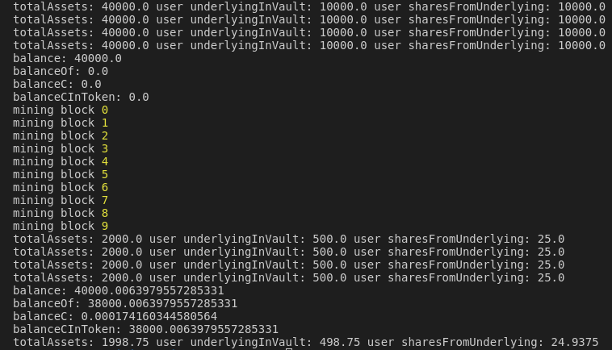

# About

This repository is an example of Yearn V2 Vault architecture being translated into new ERC-4626 proposed standard for Vaults. Yearn Vault contract is exchanged with minimal implementation offered by [Rari's solmate](https://github.com/Rari-Capital/solmate) ERC-4626. Controller and Strategy contracts are left untouched, Basic DAI/Compound stategy is used because of simplicity. Some function from original Yearn Vault got rewritten to operate with underlying ERC-4626. Contract is neither tested nor optimized, there is also no access control but all functions for such are implemented in new Vault.

All is run against forked network with real DAI used and actual compounding from Compound. Console.log will return internal balance sheet change (interests accured) after depositing funds into strategy and waiting some blocks for profit.

This is by no means robust simulation but could be extended easily. As is, you can just verify that Yearn V2 works fine with ERC4626 by inspecting small change in accured profits from Compound strategy. However, because of size of funds on contract and underlying Yearn Controller/Strategy architecture majority of user shares stays *locked*.



# How to run

Set `.env.example`

`yarn install`

First, start the hardhat network: `npx hardhat node`

To simulate deployment and deposits run: `npx hardhat run scripts/simulate.ts --network localhost`

# Resources

Yearn V2 Contracts: https://github.com/yearn/yearn-starter-pack

ERC4626 Discussion: https://ethereum-magicians.org/t/eip-4626-yield-bearing-vault-standard/7900/45

ERC4626 Proposal: https://github.com/ethereum/EIPs/blob/master/EIPS/eip-4626.md

# Solidity Template

Uses

- [Hardhat](https://github.com/nomiclabs/hardhat): compile and run the smart contracts on a local development network
- [TypeChain](https://github.com/ethereum-ts/TypeChain): generate TypeScript types for smart contracts
- [Ethers](https://github.com/ethers-io/ethers.js/): renowned Ethereum library and wallet implementation
- [Waffle](https://github.com/EthWorks/Waffle): tooling for writing comprehensive smart contract tests
- [Solhint](https://github.com/protofire/solhint): linter
- [Prettier Plugin Solidity](https://github.com/prettier-solidity/prettier-plugin-solidity): code formatter

This is a GitHub template, which means you can reuse it as many times as you want. You can do that by clicking the "Use this
template" button at the top of the page.

## Usage

### Pre Requisites

Before running any command, make sure to install dependencies:

```sh
$ yarn install
```

### Compile

Compile the smart contracts with Hardhat:

```sh
$ yarn compile
```

### Test

Run the Mocha tests:

```sh
$ yarn test
```

### Deploy contract to netowrk (requires Mnemonic and infura API key)

```
npx hardhat run --network rinkeby ./scripts/deploy.ts
```

### Validate a contract with etherscan (requires API ke)

```
npx hardhat verify --network <network> <DEPLOYED_CONTRACT_ADDRESS> "Constructor argument 1"
```

### Added plugins

- Gas reporter [hardhat-gas-reporter](https://hardhat.org/plugins/hardhat-gas-reporter.html)
- Etherscan [hardhat-etherscan](https://hardhat.org/plugins/nomiclabs-hardhat-etherscan.html)

## Thanks

If you like it than you soulda put a start ⭐ on it 
